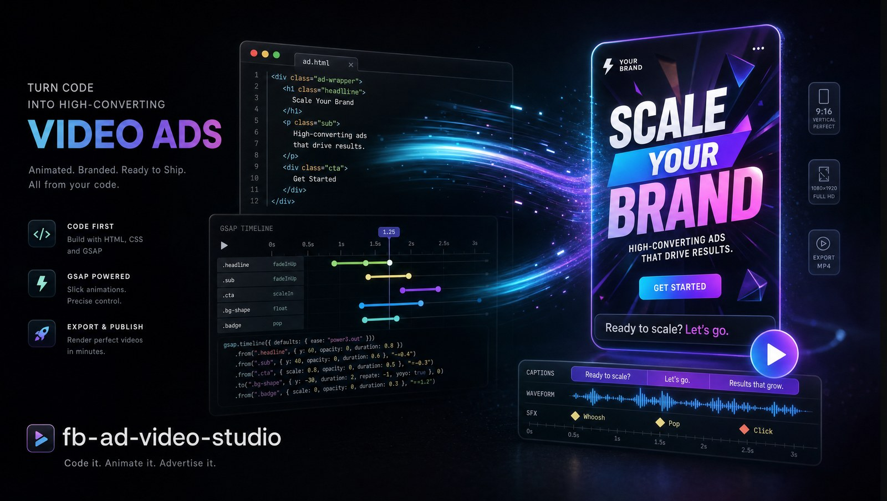

# fb-ad-video-studio



**High-converting Facebook / Instagram / TikTok video ads, built as code in [Claude Code](https://claude.com/claude-code) — no editor, no After Effects, no $3k/mo motion designer.**

---

## Your best static ad still loses to video. You know it. You're still not shipping video.

Not because you can't. Because the *pipeline* is hell.

A single 60-second founder ad is a timeline editor, a VO booth, a silence-cutting pass, caption sync, sound design, render queue, and four rounds of "move that text up 40px." Miss the sync by 200ms and it feels cheap. Outsource it and it's $1,500 and a week per variant — so you ship one, it fatigues in eleven days, and you're back to static because video "takes too long."

Meanwhile the accounts crushing it aren't making *better* videos. They're making *more* of the same proven shape — same hook arc, same pacing, same caption rhythm — with a fresh script and a new face.

**That shape is the asset. This skill is that shape, as code.**

fb-ad-video-studio turns Claude Code into your motion department. It's an opinionated layer on top of HyperFrames (HeyGen's HTML-video framework): you bring a script or a recording, Claude authors the composition, and it renders to a finished MP4 — using a structure distilled from **23 production iterations of a real founder ad**, not a blank timeline.

Because every ad is a *composition file*, you get what a timeline editor structurally can't:

- **The hook arc is baked in.** Cold-open motion hook → speaker PIP arc (hidden → PIP → full → PIP → full → lockup) → whip-pan scene cuts. The rhythm that tested best across 23 versions is the *default*, not something you rediscover at 1am.
- **Sync is automatic, and tight.** VO is transcribed to word-level timestamps; captions, SFX hits, and text reveals anchor to actual spoken words — never script estimates. 0.18s drift cuts, 0.25s reveals. It feels expensive because the timing is frame-accurate.
- **The audio pipeline is solved.** ElevenLabs Chris VO with dialed-in settings, silence-cutting that trims dead air without clipping words (77s→67s typical), and a Mixkit SFX rail with tight ad-length trims. Every "free audio" dead end is already mapped so you skip it.
- **It version-controls and templatizes.** `git diff` a headline change. And the killer move — **share a winning video ad and Claude reverse-engineers its arc, pacing, and caption rhythm into a reusable template.** The winner stops being a competitor's video and becomes your repeatable format.
- **It scales sideways.** One composition → a dozen on-brand variants for testing. New script, new VO, new offer — same proven shape, rendered, not rebuilt.

Two families ship ready:

| Template | Length | You bring | For |
|----------|--------|-----------|-----|
| **Motion-graphics spot** | 15–30s | a VO script | Offer/feature ads, retargeting, no on-camera talent |
| **Talking-head founder ad** | 45–75s | a phone recording | Founder story, authority, cold traffic |

It's MIT-licensed and free. The render runs locally. The next video ad you would have paid $1,500 and waited a week for is one `npx hyperframes render` away — and the one after that is a script swap.

**Install it, bring a script, and ask Claude for the ad. ⬇️**

---

## Install

### As a Claude Code skill (recommended)

```bash
git clone https://github.com/ai-agents-for-agencies-coaches/fb-ad-video-studio.git \
  ~/.claude/skills/fb-ad-video-studio

cd ~/.claude/skills/fb-ad-video-studio
npm install                    # pulls the HyperFrames CLI
npx hyperframes doctor         # checks Node >=22, FFmpeg, Docker
```

Claude auto-discovers the skill via `SKILL.md`. Then just ask: *"make me a 20-second motion-graphics ad for…"* or *"build a founder ad from this recording"* or *"make a video ad like this one: <url>"*.

> This skill is the **ad recipe** on top of HyperFrames — it doesn't reimplement the framework. If the base HyperFrames skills aren't present: `npx skills add heygen-com/hyperframes`.

### Requirements

- Node.js ≥ 22, FFmpeg, and Docker (render runs in Docker on Linux — apparmor blocks puppeteer otherwise)
- `ELEVENLABS_API_KEY` (only if generating VO via `scripts/tts.py`)
- `pip install faster-whisper` (for caption/SFX sync timestamps)

---

## Production pipeline

The order that survived 23 iterations. Scripts live in `scripts/`.

```
script.md
  → scripts/tts.py            VO (ElevenLabs Chris)         [or record a presenter]
  → scripts/cut-silences.py   trim dead air                 [talking-head only]
  → scripts/whisper-words.py  word timestamps (the spine)
  → scripts/reencode-footage.sh  fix sparse keyframes        [talking-head only]
  → edit the template         anchor captions/SFX to words
  → scripts/fetch-sfx.sh      Mixkit SFX rail, tight-trimmed
  → npx hyperframes lint && inspect
  → scripts/render.sh         MP4 (Docker)
```

| Script | Does |
|--------|------|
| `tts.py` | ElevenLabs Chris VO with ad-tuned voice settings |
| `whisper-words.py` | Word-level timestamps → `*.words.json` (drives all sync) |
| `cut-silences.py` | BIT cut — trims silences, keeps 0.18s room tone |
| `fetch-sfx.sh` | Mixkit SFX, trimmed to ad lengths + gain-staged under VO |
| `reencode-footage.sh` | Fixes phone-MP4 sparse-keyframe seek failures |
| `render.sh` | `npx hyperframes render --docker` (+ `--frame <t>` debug) |

---

## Templates

Real HyperFrames compositions in `templates/` — generic brand tokens (`--accent`, `--ink`, …) and `[BRACKET]` placeholder copy. Scaffolds, not constraints.

- `motion-graphics-spot/` — kinetic-typography spot. Beat arc: hook · problem · solution · proof · CTA. VO + SFX, no footage.
- `talking-head-founder-ad/` — the proven speaker PIP arc, whisper-synced captions, SFX rail, whip-pan cuts, closing lockup.

## Reverse-template workflow

The highest-leverage use: turn a winning video ad into a reusable composition. See [`references/reverse-template.md`](references/reverse-template.md). You extract **structure and pacing** (not ownable) — never a competitor's footage, VO, music, or copy.

## References

- [`references/patterns.md`](references/patterns.md) — Lottie/GSAP/caption/pacing/render gotchas from 23 builds
- [`references/audio-sources.md`](references/audio-sources.md) — what works for SFX, music, VO, silence-cutting
- [`references/reverse-template.md`](references/reverse-template.md) — extracting a template from a winning ad

## License

MIT — see [LICENSE](LICENSE).
